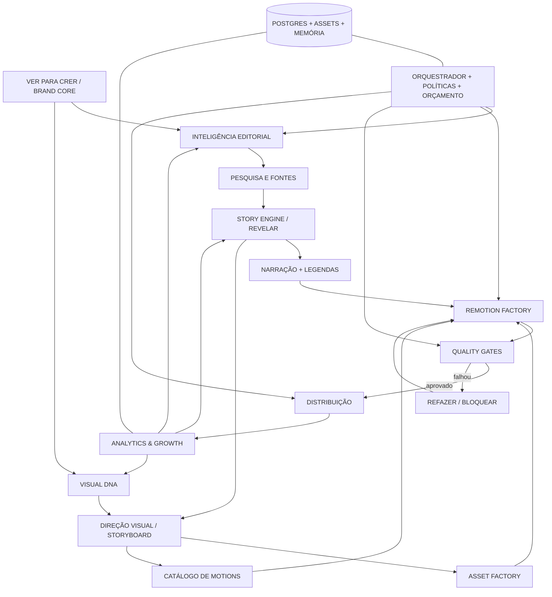

# VER PARA CRER — MASTER BLUEPRINT
**Brandbook · Story Engine · Motion Design System · Autonomous Media Factory**

**Versão 1.0 — 09/10/2026**  
**Documento-mãe:** especificação para agentes de IA, diretores criativos, roteiristas e desenvolvedores. Leia tudo antes de produzir. O objetivo é preservar identidade, narrativa, precisão e qualidade em escala.

> **Princípio central:** não fazemos slides religiosos animados. Fazemos histórias que se transformam visualmente diante dos olhos do espectador e mudam sua perspectiva.

## 0. Decisões e hipóteses

**Alinhado:** marca **VER PARA CRER**; temas de Bíblia, Jesus, Deus, existência, criação, universo e vida real; tom impactante, humano, inteligente, acolhedor e positivo; produção centrada em Remotion; vídeos verticais e horizontais; automação máxima com validação.

**Estilo escolhido: MINIMALISMO NARRATIVO VIVO.** É a elegância do motion SaaS, a lógica explicativa/editorial da Vox e ilustrações minimalistas autorais, com tipografia cinética, transições semânticas e emoção cinematográfica pontual. Influências conceituais: **50% SaaS minimalista + 30% Vox + 20% ilustração** — não são cotas fixas de duração.

**Propostas a validar:** assinatura “O eterno em novas perspectivas”; paleta abaixo; metodologia REVELAR; piloto Davi e Golias; proporções entre rig, assets e vídeo generativo. Não apresentar hipóteses como resultados medidos nem prometer viralidade.

## 1. Mapa mental — tudo conectado



**Sete macroestruturas:** (1) marca; (2) inteligência editorial; (3) narrativa/roteiros; (4) linguagem visual; (5) produção; (6) distribuição; (7) análise e aprendizado. Métricas retornam ao editorial, mas mudanças em regras críticas são versionadas e testadas.

## 2. Brand Core — narrativa da marca

**Por quê:** tornar perguntas profundas e histórias antigas visualmente compreensíveis, memoráveis e relevantes em um mundo saturado de conteúdo.  
**O quê:** histórias bíblicas, questões humanas e reflexões sobre Deus e o universo.  
**Como:** descoberta progressiva + visualização surpreendente + precisão + aplicação humana.  
**Promessa:** ao terminar, a pessoa enxerga algo que não enxergava no começo.

**Personalidade:** inteligente sem arrogância; profunda sem ser pesada; ousada sem sensacionalismo; cristã sem desprezar perguntas; acolhedora sem sentimentalismo artificial.

**Manifesto:**
> Há histórias que você conhece. E significados que talvez nunca tenha enxergado. Há perguntas que atravessam séculos — sobre Deus, a vida, o universo e o que fazemos com o tempo que temos. VER PARA CRER existe para transformar essas perguntas em imagens, ideias e histórias que se conectam à vida real. Não para encerrar toda dúvida, mas para abrir novas perspectivas. **VER PARA CRER. O eterno em novas perspectivas.**

**Marca na tela:** não gastar os três segundos iniciais com vinheta. Abrir com hook. Assinatura breve e contextual no fim; marca presente discretamente em tipografia, ritmo e símbolos durante o vídeo.

### Públicos — hipóteses a pesquisar
- **Curiosos existenciais:** querem investigar propósito, finitude e origem, sem respostas rasas.
- **Cristãos praticantes/culturais:** conhecem passagens, buscam contexto e novo olhar.
- **Jovens visual-first:** valorizam ritmo, design, linguagem natural e clareza.
- **Pessoas em fases difíceis:** procuram sentido e esperança, não culpa ou promessas mágicas.
- **Interessados em ciência/filosofia:** exigem distinguir fato, crença e interpretação.

Validar com comentários, entrevistas, testes de hooks, retenção por segmento e dados reais; não presumir que esses perfis foram comprovados.

## 3. As cinco editorias

| Editoria | Promessa | Exemplos |
|---|---|---|
| Histórias que você nunca enxergou assim | Narrativas bíblicas com contexto e nova perspectiva | Davi e Golias; José; Moisés; Pedro |
| As grandes perguntas | Deus, sofrimento, eternidade, sentido | Por que esperar? O que é fé? |
| Universo, ciência e criação | Descobertas verificáveis e reflexão filosófica | Escala do universo; origem dos elementos |
| Deus na vida real | Experiências humanas e esperança | Perdão; comparação; recomeços |
| O invisível explicado | Tornar símbolos e conceitos compreensíveis | Graça; parábolas; Reino de Deus |

**Integridade:** citar livro/capítulo/versículos; diferenciar texto bíblico de interpretação teológica; conferir fatos históricos; separar ciência de afirmações metafísicas; não prometer curas, riqueza ou soluções automáticas; não usar clickbait enganoso.

### Banco inicial de 25 episódios
1. Davi e Golias: o que realmente estava em jogo?
2. José: quando a vida não segue o plano.
3. Moisés: quando o caminho parece terminar.
4. Pedro sobre as águas: quando o medo toma conta.
5. O filho pródigo: o detalhe do retorno.
6. O bom samaritano: quem é o próximo?
7. A tempestade: o medo dos discípulos.
8. Elias: quando até os fortes se esgotam.
9. A semente de mostarda: a força do pequeno.
10. Gênesis: estrutura e significado da criação.
11. E se silêncio não significasse ausência?
12. Por que nos sentimos atrasados na vida?
13. Como a escala do universo muda nossa perspectiva?
14. Esperança é o mesmo que certeza?
15. Por que perdoar é tão difícil?
16. A casa sobre a rocha e nossas decisões.
17. Solidão versus estar sozinho.
18. O que significa amar o próximo na prática?
19. A história do universo comprimida em um ano.
20. O que a ciência sabe sobre os primeiros instantes do universo?
21. A luz das estrelas é uma viagem ao passado.
22. Por que esperar muda nossa percepção do tempo?
23. De onde vieram os elementos do nosso corpo?
24. O pequeno diante do infinito.
25. Os ciclos da natureza e as perguntas sobre propósito.

**Priorização heurística (0–5):** `0.25 relevância humana + 0.20 clareza visual + 0.20 descoberta + 0.15 verificabilidade + 0.10 reutilização de assets + 0.10 originalidade`. Temas sensíveis não passam sem verificação, independentemente da nota.

## 4. Story Engine — método REVELAR

- **R — Ruptura:** quebrar expectativa em aproximadamente 0–3 s.
- **E — Enigma:** formular pergunta central.
- **V — Visualização:** tornar problema/contraste visível.
- **E — Evidência:** apresentar texto, contexto ou fundamento.
- **L — Ligação:** conectar à vida do espectador.
- **A — Aplicação:** entregar uma perspectiva útil e honesta.
- **R — Ressonância:** terminar com uma ideia memorável.

Não aplicar como fórmula engessada. A história determina ritmo e duração.

### Short de referência: 40–60 s
| Janela aproximada | Função | Movimento |
|---|---|---|
| 0–3 s | Hook e ruptura | transformação visual imediatamente legível |
| 3–10 s | Enigma | pergunta, contraste, primeira pista |
| 10–25 s | Construção | personagem, mapa, card, linha do tempo |
| 25–40 s | Revelação | metamorfose semântica e pausa estratégica |
| 40–55 s | Aplicação | simplificação e emoção |
| 55–60 s | Ressonância | frase final, assinatura discreta |

**Hooks possíveis:** “Você conhece essa história. Mas talvez nunca tenha visto este detalhe.” / “Uma pedra. Um gigante. E uma pergunta que continua atual.” / “E se a parte mais importante dessa passagem não fosse o milagre?” / “O universo é imenso. Mas olha o que acontece quando mudamos a escala.”

**Não usar:** “a Bíblia escondeu”, milagres garantidos, medo fabricado, urgência falsa, revelações que o vídeo não sustenta.

**Voz:** português brasileiro natural, próximo, com variação de ritmo e pausas; nada de locução publicitária contínua. Nomes bíblicos precisam de revisão de pronúncia. Legenda acompanha ênfase sem transcrever palavra por palavra com excesso de efeitos.

## 5. VISUAL DNA — regras inegociáveis

### 5.1 Conceito
**MINIMALISMO NARRATIVO VIVO:** uma página limpa que se transforma em universo narrativo. Uma palavra vira personagem; uma pedra vira círculo; o círculo vira diagrama; o diagrama vira caminho; o caminho revela uma história. Cada transformação tem sentido, não é enfeite.

**Referências funcionais (estudar, não copiar):** Vox — estrutura explicativa, mapas e revelações; Ordinary Folk — fluidez e acting; BibleProject — símbolos e profundidade bíblica; Kurzgesagt — escala e abstração; Johnny Harris — pesquisa e colagem documental; BUCK, Giant Ant, Motionographer, Stash, Art of the Title — direção de arte, ritmo e experimentação. **Nunca reproduzir assets, cenas, logos, trilhas ou identidades de terceiros.**

### 5.2 Três modos dentro de UMA identidade
1. **DESCOBERTA / LIGHT:** fundo creme, cards, tipografia, diagramas, linhas, mapas e ícones. Para contexto, ciência e explicação.
2. **REFLEXÃO / DARK:** fundo carvão/azul, figura pequena, espaço negativo, luz focal, movimento contido. Para existência, silêncio, escala e emoção.
3. **HISTÓRIA / ILLUSTRATED:** personagens simples e autorais, cenários geométricos, elementos bíblicos, escala dramática e acting limitado. Para acontecimentos narrativos.

Transições entre modos devem ter justificativa narrativa. Nunca misturar três estéticas desconexas em um episódio.

### 5.3 Paleta inicial (tokens editáveis)
| Token | HEX | Uso |
|---|---|---|
| `canvas.light` | `#FAF6ED` | base creme |
| `ink.primary` | `#292725` | texto e contornos |
| `canvas.dark` | `#17243A` | reflexão, cosmos |
| `accent.gold` | `#D7AD70` | descoberta, luz, foco |
| `accent.terracotta` | `#A7654C` | conflito e calor |
| `accent.sage` | `#819B87` | serenidade e vida |
| `paper.secondary` | `#E8D7B8` | cards e contexto |

Contraste acessível obrigatório; não usar ouro claro como texto pequeno sobre creme. A paleta deve ser testada em telas móveis reais.

### 5.4 Tipografia
- Títulos: sans-serif contemporânea de personalidade forte, com pesos bem definidos; opcional serif editorial em frases contemplativas.
- Legendas: sans-serif muito legível, x-height alta, números claros, poucos estilos.
- Usar fontes com licença adequada; criar tokens `type.display`, `type.body`, `type.caption` e `type.emphasis`.
- Evitar 4 famílias no mesmo vídeo, sombras pesadas e outlines de legenda genéricos.

### 5.5 Geometria, ilustração e personagens
- Formas simples, contornos orgânicos consistentes, cantos arredondados com moderação.
- Personagens reconhecíveis pela silhueta e paleta; expressivos sem infantilização forçada.
- Separar cabeça, olhos, braços, mãos, tronco, roupas e pernas para rigs quando necessário.
- Fundo não precisa estar cheio: espaço negativo é ferramenta narrativa.
- Ilustrações autorais podem conviver com diagramas SaaS, desde que compartilhem espessura de linha, cores e comportamento de movimento.
- Jesus e figuras bíblicas devem ser representados com respeito e consistência; evitar caricatura que banalize cenas solenes.

### 5.6 Regras de motion
1. **Meaning before movement:** todo movimento deve revelar, relacionar, contrastar ou emocionar.
2. **Transformação semântica:** preferir um elemento que se transforma no próximo a cortes arbitrários.
3. **Antecipação → ação → acomodação:** aplicar easing, overshoot e follow-through com propósito.
4. **Hierarquia temporal:** um elemento principal por momento; o restante acompanha.
5. **Contraste de ritmo:** movimento rápido para descoberta, repouso para significado.
6. **Profundidade controlada:** parallax e câmera 2.5D quando acrescentarem contexto, não como efeito padrão.
7. **Consistência:** mesmos gestos e easing para famílias de componentes.
8. **Áudio + legenda + visual:** sincronizar no nível de palavra/beat, sem flashes excessivos.
9. **Safe areas:** legendas e elementos importantes longe de botões de Reels/Shorts/TikTok.
10. **Não fazer:** PNG único flutuando durante 40 s, zoom constante, cards surgindo sem relação, excesso de partículas, transições genéricas, texto ilegível.

### 5.7 Catálogo de componentes Remotion (primeira biblioteca)
| Componente | Função narrativa | Técnica |
|---|---|---|
| `HookSmash` | revelar contraste imediato | scale, mask, type |
| `MorphingWord` | palavra vira objeto/diagrama | SVG path ou crossfade mascarado |
| `RevealCard` | introduzir informação | layout, spring |
| `CardToWorld` | interface vira cenário | transform + depth |
| `ScaleContrast` | pequeno versus imenso | câmera e hierarquia |
| `TimelineJourney` | tempo e transformação | SVG path + labels |
| `MapReveal` | geografia/história | layers + masks |
| `LineConnect` | relações e causa/efeito | SVG stroke animation |
| `CharacterRig2D` | gestos e acting | SVG articulado/sprites |
| `KineticCaption` | reforçar a fala | timestamps + emphasis |
| `ParallaxScene` | imersão em camadas | transform por plano |
| `SymbolMetamorphosis` | metáfora visual | shape interpolation |
| `AtmosphericParticles` | clima e luz | Canvas/SVG com parcimônia |
| `QuietMoment` | reflexão | silêncio, espaço negativo |
| `EndSignature` | marca e ressonância | animação curta |

**Regra de implementação:** componentes recebem props tipadas e são determinísticos. Não pedir a um LLM para inventar JSX arbitrário em produção sem revisão/testes.

### 5.8 Legendas dinâmicas “hipnóticas”, mas legíveis
- Texto sempre nasce da narração alinhada temporalmente; não inventar frases diferentes do áudio.
- Agrupar 2–6 palavras conforme a cadência; destacar apenas palavras-chave.
- Usar **transformação visual**, não só bounce por palavra: “GIGANTE” pode crescer e virar silhueta; “PEDRA” pode virar objeto animado.
- Limitar intensidade, velocidade e simultaneidade; respeitar leitura e sensibilidade a flashes.
- Cores de destaque: ouro/terracota com contraste suficiente.
- Usar transcrição com timestamps de palavra; revisão automática de sincronismo e ortografia.
- Para vídeos contemplativos, reduzir kinetic captions e deixar a voz respirar.

### 5.9 Exemplos de metamorfoses visuais
- **Davi:** “gigante” cresce → silhueta de Golias → Davi minúsculo → pedra → círculo → diagrama de escala → retorno à cena.
- **José:** linha do tempo → degraus descendo → linha muda de direção → novo horizonte.
- **Semente:** ponto → semente → raiz → árvore → árvore vira mapa de relações.
- **Criação:** ponto de luz → expansão gráfica → estrelas → relógio cósmico → pessoa.
- **Perdão:** duas linhas distantes → barreira → ponte construída pela ação.
- **Tempestade:** linhas de vento → ondas → pausa/silêncio → horizonte.

## 6. Storyboard piloto — Davi e Golias

**Fonte:** 1 Samuel 17. **Duração-alvo:** 45 s (ajustar à narração real). **Mensagem:** confiança em Deus em meio ao medo, sem prometer vitória automática sobre problemas reais.

| Cena | Tempo alvo | Narração | Direção visual | Legenda/áudio |
|---|---|---|---|---|
| 1 | 0–3 s | “E se Davi não venceu por ser mais forte?” | creme; palavra FORTE enorme, que se transforma em Golias | ênfase em “mais forte”; impacto sonoro sutil |
| 2 | 3–8 s | “De um lado, um guerreiro que ninguém queria enfrentar.” | Golias ocupa a tela; Davi quase invisível | zoom de escala, não zoom genérico |
| 3 | 8–13 s | “Do outro, um jovem pastor. Sem armadura. Sem espada.” | cards “armadura” e “espada” desaparecem; Davi permanece | pausas curtas; ênfase nas ausências |
| 4 | 13–17 s | “E uma pedra.” | toda a tela esvazia; pedra no centro | silêncio breve; tipografia mínima |
| 5 | 17–26 s | “Mas há algo essencial: Davi não confiava no próprio tamanho.” | pedra vira círculo/escala; círculo vira caminho entre os personagens | transição semântica |
| 6 | 26–33 s | “Ele colocou sua confiança em Deus.” | passagem ao modo escuro, luz focal, câmera aproxima Davi | desacelerar e aquecer a voz |
| 7 | 33–41 s | “Nem sempre você escolhe o tamanho do gigante à sua frente.” | Golias torna-se sombra/metáfora de desafio; sem equiparar toda dificuldade a vitória garantida | legenda com “tamanho do gigante” |
| 8 | 41–45 s | “Mas pode escolher em quem deposita sua confiança.” | sombra se desfaz; fundo claro; assinatura discreta | ressonância, pausa final |

**Roteiro-base integral:**
> E se Davi não venceu Golias porque era mais forte? De um lado, um guerreiro que ninguém tinha coragem de enfrentar. Do outro, um jovem pastor. Sem armadura. Sem espada. E uma pedra. Mas tem um detalhe nessa história que muita gente esquece. Davi não entrou naquela batalha confiando no próprio tamanho. Ele entrou confiando em Deus. E talvez seja por isso que essa história continua atravessando gerações. Porque nem sempre você pode escolher o tamanho do gigante que aparece na sua vida. Mas pode escolher em quem deposita a sua confiança. VER PARA CRER.

**Nota:** o roteiro integral pode exceder 45 s dependendo da locução. O pipeline deve medir a duração real e ajustar cenas, jamais acelerar artificialmente a voz só para caber.

## 7. Motion Factory — o que Remotion faz e não faz

**Remotion faz muito bem:** texto, SVG, máscaras, gráficos, câmera programática, parallax, partículas, composições, timing, áudio, legendas, render e export. **Remotion não gera sozinho acting humano complexo.**

**Níveis:**
1. Motion gráfico — programático e escalável.
2. Ilustração em camadas — ótimo para Remotion.
3. 2.5D cinematográfico — ótimo com assets separados.
4. Personagem articulado — exige rig, sprites ou animações pré-criadas.
5. Acting complexo — requer animação especializada ou vídeo externo.
6. 3D/VFX avançado — requer modelos, engines e/ou renders especializados.

**Direção técnica:** usar predominantemente níveis 1–3; nível 4 seletivamente; nível 5/6 apenas onde agregarem valor. Gerar vídeo por IA como exceção e não como dependência de cada cena. Cuidado com inconsistência de personagem e custo.

### Pipeline de produção
`episode brief → fontes verificadas → roteiro aprovado por regras → narração/TTS → timestamps → storyboard estruturado → escolha de componentes → geração/reuso de assets → composição Remotion → QA técnico/editorial → export 9:16 e 16:9 → distribuição → analytics`.

### Stack proposta
- **Orquestração:** Python + Temporal (ou fila/workers equivalentes).
- **Banco:** PostgreSQL; pgvector opcional para recuperação semântica.
- **Storage:** S3/R2 para arquivos versionados.
- **IA:** modelos com saídas JSON validadas para pesquisa, narrativa e direção.
- **Voz:** TTS com licença apropriada + alinhamento temporal.
- **Vídeo:** TypeScript, React, Remotion, SVG, Canvas e FFmpeg.
- **Personagens:** SVG rig/sprites; Rive/Lottie/Three.js quando justificável e compatível.
- **Distribuição:** APIs oficiais e permissões necessárias por plataforma.
- **Observabilidade:** logs, traces, custo por episódio, métricas, alertas e dead-letter queue.

## 8. Contratos de dados entre agentes

Um episódio é um objeto versionado. Cada agente **lê um contrato e escreve outro**, nunca texto solto sem schema.

```json
{
  "episode_id": "vpc-001",
  "version": "1.0.0",
  "editorial": "historias_biblicas",
  "working_title": "O gigante",
  "primary_source": {"type": "bible", "reference": "1 Samuel 17"},
  "claims": [{"text": "Davi enfrentou Golias", "source": "1 Samuel 17", "status": "verified"}],
  "target_duration_sec": 50,
  "narration": {"language": "pt-BR", "script": "...", "audio_asset_id": null},
  "visual_mode": "minimal_story",
  "scenes": [
    {
      "id": "s01",
      "intent": "dramatic_scale_contrast",
      "component": "ScaleContrast",
      "duration_frames": 90,
      "fps": 30,
      "assets": ["david-rig-v1", "goliath-silhouette-v1"],
      "caption": {"text": "E se Davi não venceu por ser mais forte?", "emphasis": ["mais forte"]},
      "motion": {"preset": "scale_reveal_v1", "intensity": 0.8}
    }
  ],
  "outputs": ["1080x1920", "1920x1080"],
  "quality_status": "pending",
  "publish_status": "not_ready"
}
```

**Schemas adicionais:** `TopicCandidate`, `ResearchDossier`, `ClaimEvidence`, `NarrativeScript`, `VoiceAlignment`, `Storyboard`, `AssetManifest`, `RenderJob`, `QACheck`, `PublicationRecord`, `AnalyticsSnapshot`. Todos com `id`, `version`, `created_at`, `model_version`, `prompt_version`, `input_hash`, `status` e `provenance` quando aplicável.

### Máquina de estados
`IDEA → RESEARCHED → SCRIPTED → VERIFIED → STORYBOARDED → ASSETS_READY → AUDIO_READY → RENDERED → QA_PASSED → SCHEDULED → PUBLISHED → ANALYZED`.

Em falha: `RETRYABLE_ERROR`, `BLOCKED_EDITORIAL`, `BLOCKED_RIGHTS`, `BLOCKED_COST`, `BLOCKED_TECHNICAL` ou `NEEDS_REVIEW`. Publicação só a partir de `QA_PASSED`. Nunca “inventar” aprovação.

## 9. Sistema autônomo de ponta a ponta

### 9.1 Scheduler e radar
- Agenda ciclos por capacidade e orçamento, não por vontade aleatória do modelo.
- Busca perguntas, tendências e oportunidades evergreen.
- Deduplica ideias e evita episódios excessivamente parecidos.
- Prioriza por relevância humana, precisão, capacidade visual e histórico de desempenho.

### 9.2 Pesquisa e integridade
- Recupera texto bíblico/contexto com referências rastreáveis.
- Confere fatos históricos e científicos com fontes confiáveis.
- Marca interpretações e debates como tais.
- Bloqueia afirmações importantes sem evidência adequada.

### 9.3 Narrativa
- Gera 3 hooks diferentes, escolhe um com critérios explícitos.
- Produz roteiro falável, arco REVELAR e mensagem final.
- Faz leitura crítica: originalidade, clareza, honestidade e emoção.
- Produz narração TTS e timestamps reais; corrige pronúncias.

### 9.4 Direção e assets
- Escolhe modo visual por cena e componente existente.
- Reusa personagens e elementos versionados; gera novos assets só quando necessário.
- Verifica coerência visual entre cenas e direitos de uso.
- Se faltar asset, usa fallback visual aprovado ou bloqueia; não degrada silenciosamente.

### 9.5 Remotion e render
- Resolve layouts e safe areas para cada proporção.
- Sincroniza cenas com duração efetiva da voz.
- Usa seeds determinísticas e componentes com presets testados.
- Renderiza prévia em baixa resolução, valida e depois render final.
- Guarda logs, assets, hash, versão do código e custo.

### 9.6 Quality Gates (obrigatórios)
**Editorial:** fonte e interpretação corretas, mensagem coerente, sem promessa enganosa.  
**Visual:** identidade, legibilidade, contraste, safe areas, ausência de elementos cortados.  
**Motion:** continuidade, ritmo, easing, sem efeitos gratuitos ou flashes problemáticos.  
**Áudio:** pronúncia, volume, ausência de clipping, trilha licenciada, pausas adequadas.  
**Legenda:** texto fiel, timestamps, ortografia, ênfase correta, leitura móvel.  
**Técnico:** arquivo íntegro, fps, duração, codecs, render completo, thumbnail.  
**Plataformas:** conformidade com políticas, direitos, permissões e limites de API.

Se falhar, reparar somente o componente defeituoso quando possível; limitar tentativas; bloquear em falhas persistentes. Revisão humana pode ser necessária em controvérsias teológicas, copyright ou situações inéditas.

### 9.7 Publicação
- Gerar título, descrição, capa, hashtags moderadas e metadados por plataforma.
- Publicar por APIs oficiais, quando disponíveis e autorizadas; nunca presumir acesso irrestrito.
- Registrar ID da publicação, hora, plataforma, variante e status.
- Não duplicar publicações por retries: usar idempotency keys.

### 9.8 Growth Intelligence
Medir: **retenção aos 3 s, retenção ao longo do vídeo, conclusão, replay, compartilhamentos por visualização, salvamentos, comentários qualitativos, follows por visualização, custo e tempo de produção**. Comparar por tema, hook, duração, modo visual e plataforma, com cautela quanto a amostras pequenas.

**Experimentos:** trocar uma variável principal por vez (hook, capa, duração, modo, velocidade de legenda). Aprender sem permitir que métricas levem a clickbait falso ou descaracterização da marca.

### 9.9 Autonomia responsável
**Objetivo:** zero intervenções **rotineiras** por episódio, não “zero supervisão em qualquer circunstância”. Há riscos de fatos incorretos, direitos autorais, indisponibilidade de APIs e erros de render. O sistema deve saber **parar**. Alertas apenas para exceções e decisões fora de política.

## 10. Biblioteca de agentes e responsabilidades

| Agente | Entrada | Saída | Regra crítica |
|---|---|---|---|
| Opportunity Scout | tendências + memória | ideias ranqueadas | não inventar demanda |
| Researcher | ideia | dossiê com fontes | proveniência |
| Editorial Verifier | dossiê + claims | verificação e bloqueios | distinguir crença/fato |
| Story Architect | dossiê | roteiro REVELAR | mensagem verdadeira |
| Hook Editor | roteiro | hooks alternativos | promessa cumprida |
| Voice Director | roteiro | áudio + alinhamento | naturalidade |
| Art Director | roteiro + brandbook | storyboard | identidade consistente |
| Asset Producer | storyboard | SVG/PNG/rig/manifest | licenças e reuso |
| Motion Composer | storyboard + assets | projeto Remotion | componentes validados |
| QA Supervisor | render + contratos | pass/fail detalhado | não aprovar por suposição |
| Publisher | pacote aprovado | publicações | APIs e idempotência |
| Growth Analyst | métricas | hipóteses e recomendações | não superinterpretar |

## 11. Estratégia de visibilidade e marca

**Distribuição:** YouTube Shorts, Instagram Reels e TikTok como descoberta; YouTube horizontal para episódios explicativos mais profundos. Uma narrativa pode ter múltiplos formatos, mas deve ser recomposta por proporção e interface.

**Marketing além do óbvio:**
- **Hook como promessa editorial:** pergunta real nos primeiros segundos; resposta progressiva.
- **Open loops legítimos:** apresentar uma pergunta e resolvê-la no vídeo, não esconder resposta artificialmente.
- **Visual payoff:** revelação que justifica o tempo investido.
- **Shareability por significado:** frases que a pessoa compartilha por identificação ou para ajudar alguém, não por culpa.
- **Series design:** séries reconhecíveis, como “O detalhe que muda tudo”, “O invisível explicado”, “Uma pergunta sobre o universo”, “Histórias que atravessam séculos”.
- **Identidade repetível:** mesma gramática de transição, legenda e cor, com histórias diferentes.
- **Comentários como pesquisa:** perguntas recorrentes viram candidatos a episódios; moderar com respeito.
- **Capas e títulos:** promessa clara, contraste visual e honestidade; não fazer thumbnails sensacionalistas.
- **Reaproveitamento:** versão curta, longa, cards educativos e bastidores da pesquisa quando houver valor real.

**Nunca confundir:** viralidade é resultado incerto; não existe “algoritmo garantido”. O objetivo é maximizar clareza, relevância, emoção, qualidade e distribuição consistente.

## 12. Critérios objetivos de excelência

Pontuar cada item de 0 a 5 antes de publicar:
1. Hook compreensível e interessante nos primeiros 3 s.
2. Pergunta central respondida honestamente.
3. Cada cena avança a narrativa.
4. Transições possuem significado.
5. Visual consistente com o DNA.
6. Legenda legível e sincronizada.
7. Narração natural e emocionalmente apropriada.
8. Mensagem positiva sem clichê ou promessa falsa.
9. Fontes e interpretações conferidas.
10. Composição boa no celular e no formato horizontal.

**Política inicial:** 45/50 para aprovação criativa, **e** aprovação obrigatória de integridade editorial, direitos e QA técnico. Pontuação é uma heurística interna a calibrar, não benchmark de mercado.

## 13. Plano de implementação por fases

**Fase 1 — Fundação:** brandbook, 3 modos, paleta/tipografia, editorias, contratos JSON, referências e guia de integridade.  
**Fase 2 — Prova visual:** três pilotos curtos da mesma cena (SaaS, Vox, híbrido), selecionar estilo; desenvolver 10 componentes; renderizar Davi e Golias.  
**Fase 3 — Pipeline vertical:** tema → pesquisa → roteiro → voz → storyboard → assets → Remotion → MP4 com QA; ainda sem autopublicação.  
**Fase 4 — Resiliência:** filas, retries, fallback, observabilidade, custos, licenças, testes de regressão.  
**Fase 5 — Distribuição:** integrações oficiais, versões por plataforma, agendamento e logs.  
**Fase 6 — Aprendizado:** analytics, experimentos, otimização de templates e expansão do catálogo.

**Marco de aceite:** cinco episódios diferentes produzidos com identidade consistente, sem correções manuais rotineiras, passando nos gates e com custo/tempo registrados. Só então ampliar a frequência.

## 14. Estrutura de repositório sugerida

```text
ver-para-crer/
  docs/
    VER_PARA_CRER_MASTER.md
    brandbook.md
    editorial-policy.md
    motion-guidelines.md
    qa-rubric.md
  schemas/
    episode.schema.json
    scene.schema.json
    asset.schema.json
  apps/
    dashboard/
    renderer-remotion/
      src/
        compositions/
        components/
        motion-presets/
        themes/
        captions/
  services/
    orchestrator-python/
    research/
    script/
    voice/
    assets/
    publishing/
    analytics/
  assets/
    characters/
    icons/
    backgrounds/
    audio/
  episodes/
    vpc-001/
      research.json
      script.json
      storyboard.json
      asset-manifest.json
      qa-report.json
  tests/
    visual-regression/
    audio/
    schemas/
```

## 15. PROMPT-MESTRE — entregue a qualquer agente produtor

> Você integra a equipe de produção audiovisual da marca **VER PARA CRER**. Leia integralmente `VER_PARA_CRER_MASTER.md` e siga-o como fonte de verdade de marca. Sua missão é transformar temas bíblicos, espirituais, científicos ou existenciais em vídeos visualmente surpreendentes, emocionalmente humanos e editorialmente rigorosos.
>
> **Identidade obrigatória:** Minimalismo Narrativo Vivo — estética SaaS premium, storytelling explicativo/editorial inspirado em Vox, ilustração minimalista autoral, tipografia cinética, transições semânticas e momentos contemplativos. Não copiar identidades de referência.
>
> **Processo obrigatório:** (1) entender o tema e o público; (2) pesquisar e registrar fontes; (3) separar fato, interpretação e reflexão; (4) escrever 3 hooks e selecionar o mais honesto e forte; (5) desenvolver narrativa REVELAR com mudança de perspectiva; (6) produzir narração natural; (7) decompor o roteiro em cenas com intenção visual e timestamps; (8) selecionar componentes da biblioteca Remotion; (9) gerar/reusar assets coerentes; (10) sincronizar áudio, movimento e legendas; (11) renderizar; (12) executar QA e corrigir; (13) entregar arquivos e relatório de produção.
>
> **Padrão visual:** cada transformação deve contar algo. Não produzir sequência de cards desconexos, zoom em imagem única, legendas genéricas ou efeitos sem significado. Priorizar legibilidade, clareza e emoção. A primeira cena deve começar pela história, não pela vinheta.
>
> **Saídas mínimas:** `research.json`, `script.json`, `storyboard.json`, `asset-manifest.json`, `episode.json`, vídeo vertical, vídeo horizontal quando solicitado e `qa-report.json` com problemas e limitações. Não afirmar que gerou ou validou artefatos que não existem.
>
> **Restrições:** não inventar citações bíblicas ou científicas, não prometer milagres garantidos, não manipular sofrimento ou medo, não usar materiais sem direitos, não publicar sem QA. Quando houver incerteza relevante, registrar e bloquear para revisão.
>
> **Critério supremo:** a pessoa termina enxergando algo de maneira diferente — e o movimento visual foi essencial para que isso acontecesse?

## 16. Brief padrão de episódio para automação

```yaml
brand: VER PARA CRER
episode_theme: ""
editorial: ""
core_question: ""
source_references: []
viewer_takeaway: ""
target_platforms: [youtube_shorts, instagram_reels, tiktok]
target_duration_sec: 50
visual_style: minimalismo_narrativo_vivo
visual_modes_allowed: [discovery, reflection, story]
voice: pt-BR_natural_emotional
captions: kinetic_semantic
assets_policy: reuse_first
qa_required: true
publish_only_if_approved: true
```

## 17. Links de estudo e referências

- Vox: https://www.youtube.com/@Vox
- Ordinary Folk: https://www.ordinaryfolk.co/
- BibleProject: https://bibleproject.com/
- Kurzgesagt: https://www.youtube.com/@kurzgesagt
- Johnny Harris: https://www.youtube.com/@johnnyharris
- BUCK: https://buck.co/work
- Motionographer: https://motionographer.com/
- Stash: https://www.stashmedia.tv/
- Art of the Title: https://www.artofthetitle.com/
- Remotion: https://www.remotion.dev/docs/
- Remotion captions: https://www.remotion.dev/docs/captions/

**Usar referências para estudar técnica e narrativa; não replicar estética distintiva de um estúdio.** Links são pontos de pesquisa e devem ser revalidados quando usados.

---

# DIRETRIZ FINAL

**VER PARA CRER não é um canal de vídeos sobre religião com motion bonito. É uma linguagem audiovisual que transforma histórias, símbolos, perguntas e descobertas em experiências que fazem sentido para a vida.**

**O roteiro é a inteligência. O motion é a linguagem. A marca é a memória. A automação é a infraestrutura. A confiança do público é o ativo principal.**
